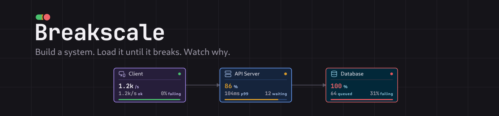
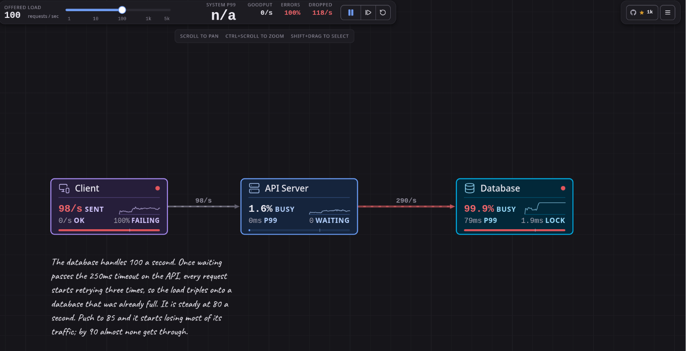

<p align="center">
  
</p>

<h4 align="center">
  <a href="https://loadrift.vercel.app">Try it</a> |
  <a href="https://github.com/omwankar/loadrift">Documentation</a> |
  <a href="CONTRIBUTING.md">Contributing</a>
</h4>

<p align="center">
  <a href="https://github.com/omwankar/loadrift/actions/workflows/ci.yml"></a>
  <a href="https://github.com/omwankar/loadrift/stargazers"></a>
  <a href="https://github.com/omwankar/loadrift/forks"></a>
  <a href="LICENSE"></a>
  <a href="CONTRIBUTING.md"></a>
</p>

<div align="center">
  
  <p align="center">
    <sub>The Retry Storm example at 100 requests a second. The database is at 99.9% busy and
    goodput is zero, because retries have tripled 100 offered requests into 348 hitting a
    database that was already full.</sub>
  </p>
</div>

Loadrift is a system design simulator for learning how distributed systems behave under load.
You place components on a canvas, wire them together, then drag a slider and watch real queueing
behaviour emerge: latency percentiles climbing, queues filling, circuit breakers tripping, whole
systems collapsing into retry storms.

Every number comes from an actual discrete-event simulation. Nothing is faked, approximated, or
animated to look plausible.

This is a customized fork of [Breakscale](https://github.com/xevrion/breakscale) by Yash Bavadiya,
with a new name, teal colour theme, and typefaces.

## Why this exists

Most system design material is static diagrams and rules of thumb. "Add a cache." "Use a queue."
It is hard to build intuition for why p99 latency falls off a cliff as utilisation passes 80
percent, or how a short timeout with retries turns one slow database into a total outage.

Loadrift runs the experiment instead. Load the Retry Storm example, drag the traffic up, and
watch goodput fall to zero while the database still runs flat out, because every request that
completes has already been abandoned by a caller that gave up.

## Getting started

You need [Bun](https://bun.sh).

```bash
git clone https://github.com/omwankar/loadrift.git
cd loadrift
bun install
bun dev
```

Open http://localhost:5173, pick an example from the left, and raise the traffic slider until
something goes red.

## Features

- **33 components.** Load balancers, caches, databases, queues and workers, plus CDNs, rate
  limiters, circuit breakers, read replicas, sharded stores, autoscalers, stream brokers,
  WebSocket gateways, serverless functions and bulkheads.
- **23 worked examples.** Sixteen teaching scenarios and seven reconstructions of real
  architectures, each one loadable in a click.
- **A real discrete-event engine.** Finite server slots, gamma-distributed service times, measured
  percentiles. No formulas standing in for a simulation.
- **Chaos controls.** Crash a node, slow it down, force an error rate, or cut a single link.
- **Deterministic.** The same seed and topology replay identically, every time.
- **Explanations built in.** Every metric and unit has a plain-language definition.
- **Runs entirely in the browser.** No account, no backend, no telemetry. Your designs stay local.

## What is in it

The 23 examples are sixteen teaching scenarios, each isolating one failure mode, plus seven
reconstructions of real architectures:

| Example             | What it teaches                                                  |
| ------------------- | ---------------------------------------------------------------- |
| Single Server       | Latency climbs sharply as the database fills up                  |
| Load Balanced       | Three servers share the load, but all still talk to one database |
| Cache Aside         | Lower the hit rate and the database takes the whole load         |
| Async Workers       | The backlog grows when workers fall behind, and drains after     |
| Retry Storm         | Retries multiply the load that caused them                       |
| Rate Limited API    | Serves slightly less, but what it serves stays fast              |
| Circuit Breaker     | Break the dependency, watch the circuit trip, then recover       |
| Sharded Database    | One shard melts while the average still looks healthy            |
| Autoscaling Service | Requests fail in the gap while new servers boot                  |

Plus **Netflix**, **Spotify**, **Discord**, **Uber**, **Twitter/X**, **Stripe** and **WhatsApp**,
reconstructed from published engineering material. Each names what it models and what it leaves
out. They are teaching diagrams, not insider knowledge.

## How the simulation works

The engine in `src/sim` is a discrete-event simulator. Requests are real objects moving through the
topology, and a few details are what make the results worth trusting:

**Finite server slots.** A component's `capacity` is how many requests it can work on at once, and
`instances` is how many copies of it are running. Everything beyond `instances × capacity` waits in
a real FIFO queue, and beyond the queue limit it is shed.

**Service time variance.** Service time is a mean plus a coefficient of variation, sampled from a
gamma distribution. Variance is what makes tail latency diverge from the average, so it is modelled
rather than assumed away.

**Abandoned work still burns capacity.** When a caller times out, the downstream keeps working on a
request nobody is waiting for. This is why retry storms are visible here rather than theoretical.

**Queues acknowledge immediately.** A request entering a queue resolves as success at that point
and the message is buffered for workers. Backlog depth is real, so you can watch it build and
drain.

**Percentiles are measured.** p50, p95 and p99 come from a ring buffer of completed request
latencies, never from multiplying a mean by a constant.

The simulation is deterministic: the same seed and topology replay identically. Correctness is
covered by a test suite asserting request conservation, that the failure breakdown sums to the
failure total, that utilisation stays within bounds, and that no snapshot field is ever `NaN` or
infinite.

## Project layout

```
src/sim/         the simulation engine. No React, no DOM, no I/O
src/components/  canvas, inspector, metrics, palette
src/content/     glossary text
src/App.tsx      shell: layout, the animation loop, persistence
```

The engine has no UI dependency, so you can drive it from a script:

```ts
import { Engine } from './src/sim/engine';
import { PRESETS } from './src/sim/presets';

const engine = new Engine(PRESETS[0].topology, 42);
for (let i = 0; i < 600; i += 1) engine.advance(1000 / 60);
console.log(engine.snapshot().system);
```

## Contributing

Contributions are welcome, especially new components, new teaching examples, and better
explanations. See [CONTRIBUTING.md](CONTRIBUTING.md) for how the project is put together and what
the bar is for a change.

The short version: the numbers have to be true. This is a tool people learn from, so a plausible
looking number is worse than no number at all.

## Built with

React, TypeScript and Vite, with Lucide for icons. The canvas is hand-rolled SVG and the charts are
drawn directly rather than pulled from a charting library, which keeps the bundle small and the
rendering predictable.

## Star history

<a href="https://star-history.com/#omwankar/loadrift&Date">
  <picture>
    <source media="(prefers-color-scheme: dark)" srcset="https://api.star-history.com/svg?repos=omwankar/loadrift&type=Date&theme=dark" />
    <source media="(prefers-color-scheme: light)" srcset="https://api.star-history.com/svg?repos=omwankar/loadrift&type=Date" />
    
  </picture>
</a>

## License

[MIT](LICENSE)

Loadrift is a fork of [Breakscale](https://github.com/xevrion/breakscale). The original copyright
is retained in [LICENSE](LICENSE).

The bundled webfonts in `public/fonts/` are **not** covered by the MIT licence. They are licensed
separately under the [SIL Open Font License 1.1](https://scripts.sil.org/OFL), which ships
alongside each font family as that licence requires:

- IBM Plex Sans — Copyright 2017 IBM Corp. and IBM Plex Sans authors
- IBM Plex Mono — Copyright 2017 IBM Corp. and IBM Plex Mono authors
- Kalam — Copyright 2014 Indian Type Foundry
